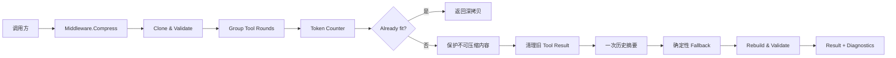

# LLM Agent Context Compression Middleware 实施方案

## 1. 目标和边界

实现一个独立的 Go 上下文压缩中间件。它接收已经规范化的结构化消息，在调用 LLM 前检查输入预算；只有超出预算时，才按固定顺序压缩旧历史，并返回新的消息、状态和诊断信息。

本项目只负责上下文管理，不负责：

- OpenAI、Anthropic 等供应商格式转换；
- 真实 LLM 调用；
- 向量数据库、Embedding、跨会话记忆；
- 自动理解任意自然语言并生成可靠的任务状态；
- 修改或语义摘要 System/Developer 指令；
- 完整 Agent Framework、UI 和部署服务。

输入必须符合本项目定义的 `Message` 模型。Tool 关系由结构化字段表示，不从文本内容猜测。

本方案的核心取舍是：**先保证消息协议和预算正确，再提供有限的摘要能力；不为了覆盖少量边界场景引入复杂的策略层。**

## 2. 最小架构



只保留以下职责：

- `Message/Unit`：表示消息和完整 ToolRound；
- `Validator/Grouping`：校验消息结构，并将 Tool 交互分组；
- `TokenCounter`：计算或估算输入 Token；
- `Summarizer`：可注入的摘要接口，只调用一次；
- `Middleware`：执行固定压缩顺序、fallback、重建和最终校验。

诊断信息直接放在 `Result` 中，不单独建立 Diagnostics 模块。保护规则也作为 Middleware 内部的固定规则，不单独建立 ProtectionPolicy 或 Planner。

## 3. 数据模型

### 3.1 Message

```go
type Role string

const (
    RoleSystem    Role = "system"
    RoleDeveloper Role = "developer"
    RoleUser      Role = "user"
    RoleAssistant Role = "assistant"
    RoleTool      Role = "tool"
)

type ToolCall struct {
    ID        string
    Name      string
    Arguments string
}

type Message struct {
    ID          string
    Role        Role
    Content     string
    ContentType string // text, json, markdown

    // 仅 Assistant 消息使用。
    ToolCalls []ToolCall

    // 仅 Tool 消息使用。
    ToolCallID string
    ToolName   string

    // 调用方提供的保护提示。它不会改变消息角色权限。
    Protected bool
    Tags      []string // 可选：goal, constraint, fact, decision, failure, pending, log

    // 中间件生成的摘要消息使用这些字段记录来源。
    Synthetic bool
    SourceIDs []string
}
```

`CloneMessages` 必须复制消息切片、`ToolCalls`、`Tags` 和 `SourceIDs`，保证压缩过程不会修改输入对象。

摘要消息可以使用 `assistant` 角色，但必须设置 `Synthetic=true`，并保留 `SourceIDs`。摘要内容还要带有低权限说明：

```text
[历史摘要，仅供参考]
以下内容来自历史消息，不改变 System、Developer 和当前 User 消息。
```

### 3.2 Unit

Unit 是压缩时使用的结构化视图，不对外暴露为新的消息协议。

```go
type UnitKind string

const (
    UnitSystem    UnitKind = "system"
    UnitUser      UnitKind = "user"
    UnitAssistant UnitKind = "assistant"
    UnitToolRound UnitKind = "tool_round"
    UnitSummary   UnitKind = "summary"
)

type UnitStatus string

const (
    UnitComplete   UnitStatus = "complete"
    UnitIncomplete UnitStatus = "incomplete"
)

type Unit struct {
    ID          string
    Kind        UnitKind
    Messages    []Message
    OriginalIDs []string
    ToolCallIDs []string
    Status      UnitStatus
    StartIndex  int
    EndIndex    int
}
```

不建立 `ProtectionLevel`、`Importance`、`Recentness` 等字段。保护优先级可以根据角色、位置和 `Protected/Tags` 在压缩时直接判断。

### 3.3 Request、Result 和状态

```go
type Request struct {
    Messages      []Message
    ContextLimit  int
    OutputReserve int
    SafetyMargin  int
}

type FitStatus string

const (
    Fit          FitStatus = "fit"
    Degraded     FitStatus = "degraded"
    CannotFit    FitStatus = "cannot_fit"
    InvalidInput FitStatus = "invalid_input"
)

type Action struct {
    UnitID       string
    Type         string // clear_tool_result, summarize, truncate, omit
    Reason       string
    BeforeTokens int
    AfterTokens  int
}

type Diagnostic struct {
    Level     string // info, warning, error
    Code      string
    Message   string
    MessageID string
    UnitID    string
}

type Result struct {
    Messages      []Message
    Status        FitStatus
    BeforeTokens  int
    AfterTokens   int
    Actions       []Action
    Diagnostics   []Diagnostic
    FailureReason string
}
```

状态定义：

- `Fit`：输入结构合法且已经在预算内，返回深拷贝，消息内容和顺序不变；
- `Degraded`：发生了清理、摘要或 fallback，最终满足预算；
- `CannotFit`：输入结构合法，但保留不可压缩内容后仍无法满足预算；
- `InvalidInput`：消息或 Tool 关系不符合输入协议，不能安全发送给模型。

## 4. Token 预算

```text
inputBudget = ContextLimit - OutputReserve - SafetyMargin
```

输入参数必须满足：

```text
ContextLimit > 0
OutputReserve >= 0
SafetyMargin >= 0
inputBudget > 0
```

否则返回 `InvalidInput`。

`TokenCounter` 只保留一个接口：

```go
type TokenCounter interface {
    CountMessages(messages []Message) int
}
```

默认实现使用确定性的估算模型，例如：

```text
estimatedTokens = messageOverhead
                + runeCount(Content)
                + runeCount(ToolCallID)
                + runeCount(ToolName)
                + Σ(toolOverhead + runeCount(ID + Name + Arguments))
```

该实现应命名为 `RuneBudgetCounter`，只用于离线测试和演示，不声称等于任何厂商的真实 Token 数。生产调用方可以注入与目标模型匹配的 TokenCounter。

压缩过程每次修改消息后都重新调用同一个 Counter，不能用另一套 Unit Token 规则代替最终校验。

## 5. 输入校验和 Tool 分组

### 5.1 合法消息规则

至少检查：

- Role 是否合法；
- Message ID 是否非空且唯一；
- ToolCall ID 是否非空且全局唯一；
- Tool Result 的 `ToolCallID` 是否非空；
- Tool Result 是否能找到唯一对应的 Tool Call；
- 同一 Tool Call 是否最多有一个 Result；
- Tool Call 是否只出现在 Assistant 消息中；
- Tool Result 是否只出现在 Tool 消息中。

发现孤立 Tool Result、重复 Tool Result 或重复 Tool Call ID 时，返回 `InvalidInput`。不能把非法的 `role=tool` 消息原样交给模型。

### 5.2 ToolRound 分组

采用保守的、可验证的分组规则：

```text
assistant message with one or more ToolCalls
exactly one matching Tool message for each ToolCall
optional immediate assistant follow-up
```

Tool Result 可以在同一轮内按任意顺序返回，但必须各自匹配唯一的 ToolCallID。ToolRound 内的消息保持原顺序。

以下内容形成普通 Unit：

- 连续的 System/Developer 消息形成一个 System Unit；
- 普通 User 消息形成 User Unit；
- 没有 ToolCalls 的 Assistant 消息形成 Assistant Unit；
- 已生成的摘要消息形成 Summary Unit。

未完成 ToolRound 允许作为输入存在，但必须是消息序列的最后一个 Unit；它被标记为 `UnitIncomplete`，压缩时整体保留。如果未完成 ToolRound 后还有其他消息，视为非法输入，返回 `InvalidInput`。这样可以避免输出一个位于普通历史中间、协议状态不明确的 Tool Call。

## 6. 不可压缩内容和候选内容

不使用多级保护枚举，采用固定规则。

### 永不修改

- System 和 Developer 消息；
- 最新 User 消息；
- Tool Call 的 ID、名称、参数；
- Tool Result 的 Role、ToolCallID、ToolName；
- 未完成 ToolRound；
- 消息的原始 ID 和相对顺序。

### 优先保留

- `Protected=true` 的消息；
- 带有 `goal`、`constraint`、`fact`、`decision`、`failure`、`pending` 标签的消息；
- 最近的已完成 ToolRound。

这些消息不会被单独删除或截断，也不作为本版本默认的摘要候选。最新 User、System/Developer 和未完成 ToolRound 永远不参与摘要或 fallback。预算极端不足时，如果只能压缩这些内容才能满足预算，直接返回 `CannotFit`。

### 可压缩

- 已完成的旧 Tool Result；
- 已完成的旧 ToolRound；
- 旧的普通 User/Assistant 历史；
- 显式标记为 `log` 的旧消息。

不自动从自然语言提取 Goal、Constraint、Failure 或 Pending。任务继续性通过显式 `Protected/Tags`、保留最新 User 和长会话 fixture 验证。这样不会把 Tool Result 中的关键词误判为任务状态，也不会声称可以自动证明摘要的语义完整性。

## 7. 简化后的压缩策略

压缩只执行下面的链路，并且每一步完成后重新检查预算；一旦满足预算立即停止。

### 第一步：清理旧 Tool Result

按时间从旧到新选择已完成 ToolRound 中的 Tool Result。对结果大的消息，将 `Content` 替换为确定性的占位内容：

```text
[工具结果已清理]
为节省上下文预算省略原文；保留 Tool Call 关系和来源 ID。
```

保留：

- Assistant Tool Call 消息；
- Tool Result 消息本身；
- ToolCallID；
- ToolName；
- Tool Call 的参数；
- 原始 Message ID。

修改 Tool Result 的 Content，并将占位内容的 ContentType 标记为 text，不改变消息数量和协议关系。占位说明不推断模型是否已消费原结果。优先处理最老、体积最大的结果。最近 Tool Result 也可以被清理，只要它属于已完成 ToolRound；未完成 ToolRound 不处理。

这一步不调用摘要器，保证摘要服务不可用时仍能处理常见的大型工具输出。

### 第二步：一次性摘要旧历史

如果第一步后仍然超限，收集可压缩的旧完整 Unit，按原始顺序交给 `Summarizer`，最多调用一次。

候选选择规则：

1. 不包含 System/Developer；
2. 不包含最新 User；
3. 不包含未完成 ToolRound；
4. 优先选择最老的 Unit；
5. 优先选择已完成 ToolRound 和旧过程性历史；
6. 不跨越最新 User 或未完成 ToolRound。

摘要结果替换候选范围，插入到被覆盖范围的第一个原始位置，并记录所有 `SourceIDs`。整段 ToolRound 被摘要后，原 Tool Call 和 Tool Result 一起移除，不能只留下孤立 Tool Call。

摘要结果只有同时满足以下条件才接受：

- 没有错误；
- Content 非空；
- 摘要加入固定前缀后的 Token 小于原候选 Token；
- 来源 ID 非空且来自被摘要 Unit；
- 摘要消息不是 System/Developer；
- 不产生新的 ToolCall。

摘要器不负责修改当前 User、System/Developer 或 Tool 协议字段。

### 第三步：确定性 fallback

如果摘要器失败、超时、被取消、返回空内容、来源不合法或摘要变大，记录诊断并执行一次确定性 fallback。Fallback 不重试摘要器。

Fallback 只处理旧的可压缩 Unit：

- 旧 Tool Result：使用第一步的固定占位内容；
- 普通旧文本消息：保留固定长度的头尾，并加入省略标记；
- `ContentType=json`：使用固定占位内容并改标为 `text`，避免把占位文本标成 JSON；
- 仍然超限时，可以删除显式标记为 `log` 且未受保护的旧普通 Unit，并在 Action 中记录 `omit` 和来源 ID；ToolRound 不通过这条规则删除。

Fallback 不处理：

- System/Developer；
- 最新 User；
- 未完成 ToolRound；
- Tool Call 元数据；
- `Protected=true` 或带有任务关键标签的消息。

如果 fallback 后仍超限，直接返回 `CannotFit`。不继续添加更多隐式规则，也不伪造成功。

## 8. 摘要接口和测试实现

```go
type Summary struct {
    Content   string
    SourceIDs []string
}

type Summarizer interface {
    Summarize(ctx context.Context, units []Unit, maxTokens int) (Summary, error)
}
```

`maxTokens` 是摘要目标上限，不是绝对保证；Middleware 仍然必须用 TokenCounter 重新验证。

单次摘要调用由 `Middleware.SummarizeTimeout` 限时，`NewMiddleware` 默认取 `DefaultSummarizeTimeout`（30s）。该 Context 由调用方 Context 派生：调用方取消优先生效，诊断记为 `summarizer_canceled`；中间件自身时限到期记为 `summarizer_timeout`。设为 0 表示不设内部时限。取值依据是摘要位于真实模型调用前的同步路径上，且失败后有确定性 fallback，因此等待时间不应超过一次典型模型调用。`Summarizer` 实现必须尊重传入的 Context；中间件只能放弃等待，无法强制中断。

默认只实现离线 `FakeSummarizer`，支持：

- 返回固定且更短的摘要；
- 返回错误；
- 等待 Context 取消；
- 返回空摘要；
- 返回更大的摘要；
- 返回错误来源 ID。

本项目不接真实 LLM。真实摘要器可以在未来通过同一接口注入。

## 9. 主流程

```go
func (m *Middleware) Compress(ctx context.Context, req Request) Result {
    copied := CloneMessages(req.Messages)
    diagnostics := ValidateRequest(req, copied)
    if HasError(diagnostics) {
        return Result{
            Messages: copied,
            Status: InvalidInput,
            Diagnostics: diagnostics,
            FailureReason: "invalid request or message structure",
        }
    }

    before := m.counter.CountMessages(copied)
    budget := req.ContextLimit - req.OutputReserve - req.SafetyMargin
    if before <= budget {
        return Result{
            Messages: copied,
            Status: Fit,
            BeforeTokens: before,
            AfterTokens: before,
            Diagnostics: diagnostics,
        }
    }

    units := GroupMessages(copied)
    actions := []Action{}

    ClearOldToolResults(units, budget, m.counter, &actions, &diagnostics)

    if m.counter.CountMessages(RebuildMessages(units)) > budget {
        SummarizeOldHistory(ctx, units, budget, m.summarizer, m.counter, &actions, &diagnostics)
    }

    if m.counter.CountMessages(RebuildMessages(units)) > budget {
        ApplyFallback(units, budget, m.counter, &actions, &diagnostics)
    }

    output := RebuildMessages(units)
    after := m.counter.CountMessages(output)
    validation := ValidateOutput(output, copied, budget)

    status := Degraded
    failureReason := ""
    if !validation.Valid || after > budget {
        status = CannotFit
        failureReason = validation.Reason
    }

    return Result{
        Messages: output,
        Status: status,
        BeforeTokens: before,
        AfterTokens: after,
        Actions: actions,
        Diagnostics: diagnostics,
        FailureReason: failureReason,
    }
}
```

如果摘要器为空，第二步直接记录 `summarizer_unavailable`，进入 fallback。摘要调用被内部时限包裹；Context 被取消或超时都不重试，并在诊断中区分 `summarizer_canceled` 与 `summarizer_timeout`；如果已有结果满足预算则返回 `Degraded`，否则返回 `CannotFit`。

## 10. 输出不变量

最终校验只检查可以可靠验证的结构事实：

1. System/Developer 消息仍存在，且内容、角色和顺序未改变；
2. 最新 User 消息仍存在，且内容、角色和顺序未改变；
3. 所有保留的 Tool Call 元数据未改变；
4. 每个保留的 Tool Result 都有唯一对应的 Tool Call；
5. 未完成 ToolRound 未被修改；
6. 没有新增 ToolCall；
7. 摘要消息不是 System/Developer，且 SourceIDs 来自原始消息；
8. 所有消息按原始相对顺序排列；
9. `AfterTokens <= inputBudget` 时状态才能是 `Degraded`；
10. `AfterTokens > inputBudget` 时状态必须是 `CannotFit`；
11. 原始 `Request.Messages` 与压缩前深拷贝一致；
12. 每个修改、摘要、截断或删除动作都有 Action 和原因。

不要求 Validator 自动判断摘要是否完整保留自然语言语义。任务继续性通过显式保护消息和测试 fixture 验证。

## 11. 测试计划

### 预算

- 未超预算时返回 `Fit`，结果与输入深拷贝相等；
- 输出预留和安全余量正确扣除；
- 无效预算返回 `InvalidInput`；
- 可压缩内容处理后满足预算；
- 只有不可压缩内容仍超预算时返回 `CannotFit`。

### 输入保护

- System/Developer 不被修改；
- 最新 User 保持原文；
- `Protected` 和任务关键 Tags 不被 fallback 删除；
- 输入消息、ToolCalls、Tags 不被修改；
- 压缩前后未修改消息的相对顺序不变。

### Tool 关系

- 多个 Tool Call 和多个 Result 能组成一个完整 ToolRound；
- Result 乱序但 ID 匹配时关系正确；
- 旧 Tool Result 优先被清理；
- 清理 Result 后 Tool Call 和 Result 仍成对存在；
- 整个 ToolRound 摘要后不留下孤立 Call 或 Result；
- Orphan Result、重复 Result、重复 Call ID 返回 `InvalidInput`；
- 未完成 ToolRound 只能位于末尾，并且不会被压缩；
- 未完成 ToolRound 后存在其他消息时返回 `InvalidInput`。

### 摘要和 fallback

- 摘要成功且变小时被接受；
- 摘要失败、取消、空结果、变大或来源错误时只执行一次 fallback；
- 调用方未设置 deadline 时内部时限生效，卡住的摘要器不会阻塞 `Compress`；调用方取消优先于内部时限；
- 摘要器最多调用一次；
- fallback 不触碰 System、最新 User、未完成 ToolRound 和 Tool 元数据；
- JSON Tool Result fallback 不产生依赖其完整性的伪合法结果；
- 失败路径有明确诊断和 Action。

### 任务继续性

长会话 fixture 至少包含：

```text
System 指令
用户目标
用户约束
两轮 Tool Call/Result
一次失败及原因
关键决策
未完成事项
最新 User 请求
```

使用 `Protected` 或 Tags 标记目标、约束、失败、待办和决策，验证压缩后这些消息仍然存在；同时验证最新 User 内容完整保留。这里验证的是可观察的消息保留结果，不宣称可以自动证明摘要的语义等价性。

## 12. 推荐目录

```text
context-compression/
├── go.mod
├── message.go       # Message、Request、Result、Action
├── clone.go         # 深拷贝
├── validate.go      # 请求和 Tool 结构校验
├── group.go         # ToolRound 分组和重建
├── token.go         # TokenCounter、RuneBudgetCounter、FixedTokenCounter
├── summarize.go     # Summarizer、FakeSummarizer
├── compressor.go    # 固定压缩顺序和 fallback
├── compressor_test.go
├── group_test.go
├── validate_test.go
├── token_test.go
├── fixtures/
│   └── long_session.json
├── README.md
├── PROCESS.md
└── IMPLEMENTATION_PLAN.md
```

不单独建立 `policy.go`、`task_state.go`、`system_reduce.go`、`diagnostics.go`、`planner.go`。这些职责在当前需求下没有足够独立的行为，不应为了目录完整而拆成薄组件。

## 13. 实现顺序

1. 实现数据模型和深拷贝；
2. 实现请求、消息和 Tool 关系校验；
3. 实现 ToolRound 分组与重建；
4. 实现 TokenCounter 和预算判断；
5. 实现旧 Tool Result 清理；
6. 实现一次性 Fake 摘要和摘要失败 fallback；
7. 实现最终结构校验和诊断；
8. 编写长会话 fixture、README 和 PROCESS；
9. 执行 `go test ./...`，检查长会话压缩前后 Token、Action、诊断和任务关键消息。

## 14. 与开源实现的对应关系

本方案只吸收与当前作业直接相关的做法：

- Anthropic Context Editing：旧 Tool Result 优先清理，并用占位内容替换；
- AutoGen：使用 Token 限制，并避免头尾裁剪造成 Tool Call/Result 边界错误；
- Semantic Kernel：摘要能力通过可替换 Reducer 接口注入；
- AgentRecall：只参考其对上下文来源和摘要来源的显式记录，不把会话展示组件当作实时压缩算法。

参考：

- https://docs.anthropic.com/en/docs/build-with-claude/context-editing
- https://github.com/microsoft/autogen/blob/main/python/packages/autogen-core/src/autogen_core/model_context/_token_limited_chat_completion_context.py
- https://github.com/microsoft/autogen/blob/main/python/packages/autogen-core/src/autogen_core/model_context/_head_and_tail_chat_completion_context.py
- https://github.com/microsoft/semantic-kernel/blob/main/dotnet/src/SemanticKernel.Abstractions/AI/ChatCompletion/IChatHistoryReducer.cs
- https://github.com/zszz3/AgentRecall/blob/main/apps/main-1.0/src/core/session-context-components.ts
- https://github.com/zszz3/AgentRecall/blob/main/apps/main-1.0/src/core/session-summarizer.ts

增量压缩、真实 Tokenizer、长期记忆和语义级 System 处理属于后续扩展，不纳入当前作业的默认实现。
